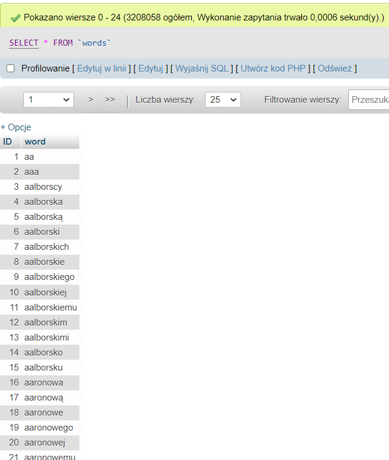
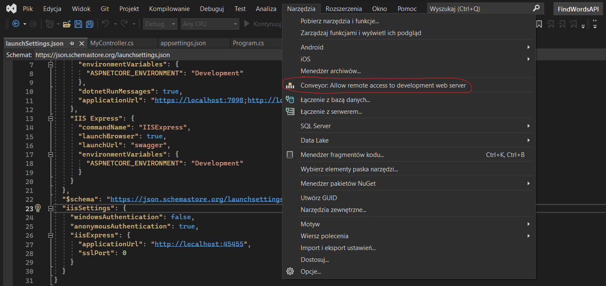
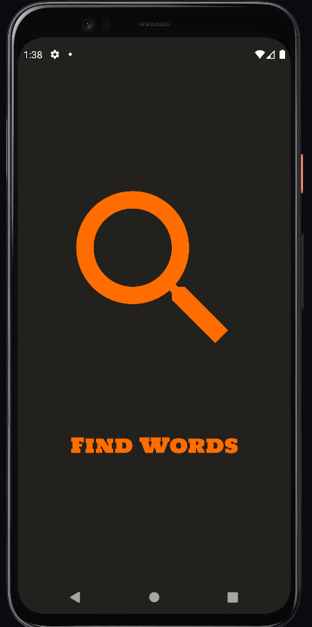
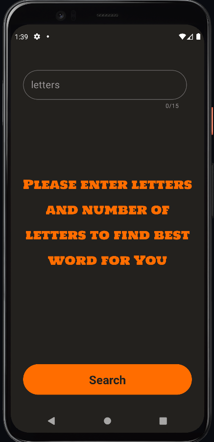
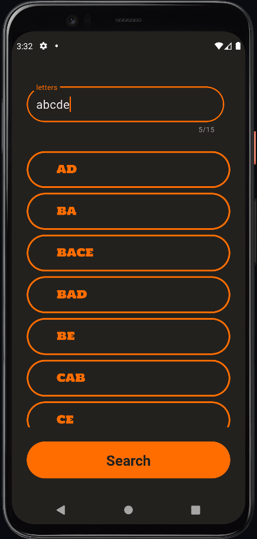
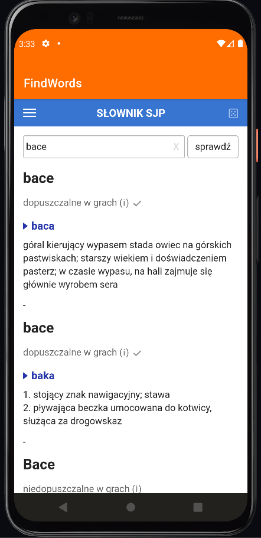

<!--
*** Thanks for checking out the ToDoAPP. If you have a suggestion
*** that would make this better, please fork the repo and create a pull request
*** or simply open an issue with the tag "enhancement".
*** Don't forget to give the project a star!
*** Thanks again! Now go create something AMAZING! :D
-->

<!-- PROJECT LOGO -->
 

  

<h3 align="center">FindWords</h3>

  

    Find every Polish word which contains only given letters.
     
    <a href="https://github.com/mateuszdybich1/FindWords"><strong>Explore the docs »</strong></a>
     
     
    <a href="https://github.com/mateuszdybich1/FindWords">View Demo</a>
    ·
    <a href="https://github.com/mateuszdybich1/FindWords/issues">Report Bug</a>
    ·
    <a href="https://github.com/mateuszdybich1/FindWords/issues">Request Feature</a>
  

<!-- TABLE OF CONTENTS -->

  
Table of Contents

  <ol>
    <li>
      <a href="#about-the-project">About The Project</a>
      <ul>
        <li><a href="#built-with">Built With</a></li>
      </ul>
    </li>
    <li><a href="#contact">Contact</a></li>

  </ol>

<!-- ABOUT THE PROJECT -->
## About The Project

This project is created for people who want to learn new Polish words. User must enter some letters, and app will call FindWordsAPI which creates every combination of given letters, then matches if created word exists in MySql database, and returns list of matching words. Database is hosted locally by using XAMPP, and contains words from file available here: https://sjp.pl/sl/growy/. 
FindWordsAPI is also hosted locally. Internet connection is required to use this app. To check by yourself how this app works, it's needed to:
- Download XAMPP (https://www.apachefriends.org), run local MySQL database, create table "words" and add every row from file to database. 

  

- Download Visual Studio (https://visualstudio.microsoft.com), install the ASP.NET workload, download and install Conveyor tool (https://marketplace.visualstudio.com/items?itemName=vs-publisher-1448185.ConveyorbyKeyoti), download and run FindWordsAPI (https://github.com/mateuszdybich1/FindWordsAPI),
click on Tools > Conveyor: Allow remote access to development web server, copy HTTP Remote URL IPv4 and Port.

  

- Download and install IntelliJ IDEA or Android Studio, download and run Android Emulator device, download this repo, replace IP and Port in line 117 in MainActivity.kt with copied IP and Port and run this project.

How to use this app:
* After a few seconds of splash screen, user will be taken to the main page view which contains edit text and button.

  
  

* User must enter at least 1 letter and click "Search" button to find every word from database that contains only given letters.

  

* Next, user can click on word tile to be redirected to the word definition from the page https://sjp.pl/

  

(<a href="#readme-top">back to top</a>)

### Built With

* [![Next][IntelliJ]][IntelliJ-url]
* [![Next][Kotlin]][Kotlin-url]
* [![Next][C#]][C#-url]
* [![Next][Material]][Material-url]
* [![Next][Volley]][Volley-url]

(<a href="#readme-top">back to top</a>)

<!-- CONTACT -->
## Contact

Mateusz Dybich  - mateuszdybich1@gmail.com

Project Link: [https://github.com/mateuszdybich1/FindWords ](https://github.com/mateuszdybich1/FindWords )

(<a href="#readme-top">back to top</a>)

<!-- MARKDOWN LINKS & IMAGES -->
<!-- https://www.markdownguide.org/basic-syntax/#reference-style-links -->
[Volley]: https://img.shields.io/badge/Volley-yellow
[Volley-url]: https://google.github.io/volley/
[C#]: https://img.shields.io/badge/C%20Sharp-239120?logo=csharp&logoColor=fff&style=for-the-badge
[C#-url]: https://learn.microsoft.com/en-us/dotnet/csharp/
[Material]: https://img.shields.io/badge/Material%20Design-757575?logo=materialdesign&logoColor=fff&style=for-the-badge
[Material-url]: https://m2.material.io/
[Firebase]: https://img.shields.io/badge/Firebase-red?style=for-the-badge&logo=Firebase&logoColor=white
[Firebase-url]: https://firebase.google.com/
[Kotlin]: https://img.shields.io/badge/Kotlin-0095D5?&style=for-the-badge&logo=kotlin&logoColor=white
[Kotlin-url]: https://kotlinlang.org/
[IntelliJ]: https://img.shields.io/badge/IntelliJ_IDEA-000000.svg?style=for-the-badge&logo=intellij-idea&logoColor=white
[IntelliJ-url]: https://www.jetbrains.com/idea/